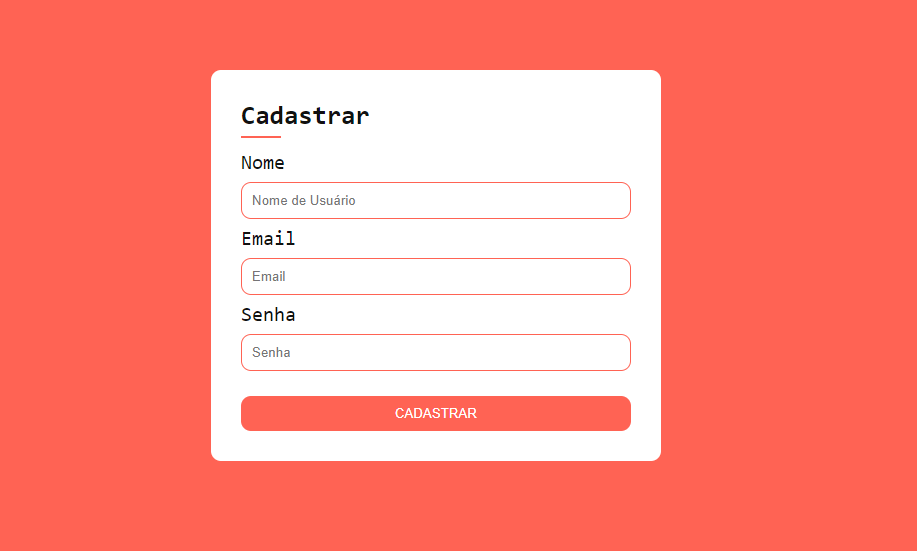

## Página de Cadastro

  

Demonstração da tela

## Sobre
Esse projeto consiste na elaboração de uma página de cadastro, na qual terão campos de entrada, como "Nome", "email" e "senha". O objetivo deste projeto é apenas para fins didáticos, visando a fixação dos conteúdos estudados.

## Tecnologias utilizadas
- HTML
- CSS